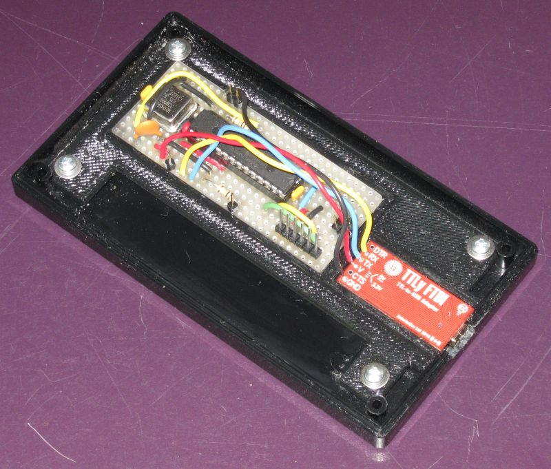
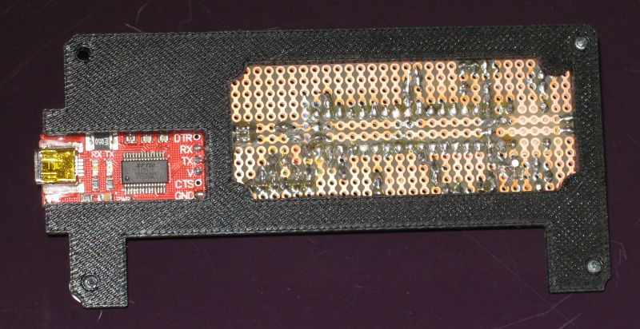
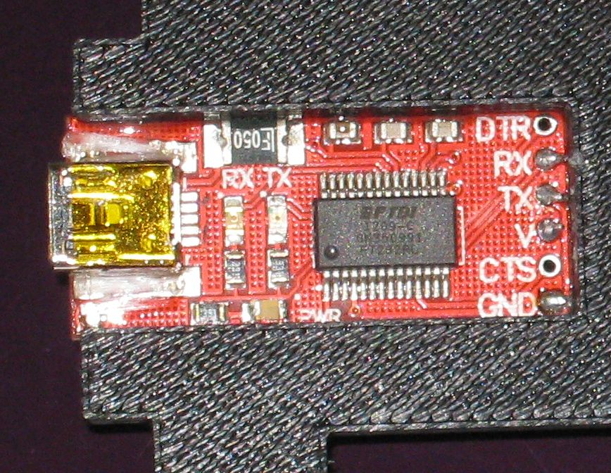

# PIC Project Box Mounting Bracket

## Project Overview

The purpose of the mounting bracket is to provide a convenient mounting bracket for prototype 
boards and USB to serial boards for projects. 

* The project box intended to be used has mounting holes prefabricated in the lid. 
* The bracket will be attached to those holes with #4 sheet metal screws.
* Platforms for printed circuit boards are incorporated into the design of the bracket. 
* Epoxy will be added to the inside edges of the mounting platforms. Once bonded the printed circuit 
boards will add mechanical strength to the bracket.

First image omly shows a reppresention of the model in OpenSCAD. The second image is a photo of the bracket mounted on a box lid with boards mounted on the bracket plate.

Mounting bracket with boards from underside

Extra support has been added to the USB connector. A small amount of epoxy and chopped glass fibre strands have been added on the sides of the surface mount USB mini B connector so that it is more securely attached to the PCB.

* [Link to STL file](http://www3.telus.net/danpeirce/notes/3D/pic-box-bracket/pic-box-bracket.stl)
* The OpenSCAD file is in the repository. 

## Other Parts For the Project

* [TTLyFTDI USB-to-TTL Cable Adapter](https://solarbotics.com/product/39240/) from Solarbotics
* [SB300 76 x 31mm, Half-sized Solder Breadboard](https://solarbotics.com/product/20900/) from Solarbotics
* [BOX ABS 5.31X2.94X1.96" BLK - 377-1165-ND](http://www.digikey.ca/product-search/en?x=16&y=17&lang=en&site=ca&KeyWords=377-1165-ND) from Digikey
* [CONN JACK PHONE 1/4" 3POS OPEN - SC1317-ND](http://www.digikey.ca/product-search/en?vendor=0&keywords=sc1317-ND) from Digikey
* [SOCKET IC OPEN FRAME 28POS .3"] (http://www.digikey.ca/product-search/en/connectors-interconnects/sockets-for-ics-transistors/1442972) from Digikey
* [PIC18F2620-I/SP IC MCU 8BIT 64KB FLASH 28SDIP](http://www.digikey.ca/product-detail/en/PIC18F2620-I%2FSP/PIC18F2620-I%2FSP-ND/613228)  from Digikey
* [OSC XO 32.000MHZ TTL PC PIN - CTX799-ND] (http://www.digikey.ca/product-detail/en/MXO45HST-3C-32M0000/CTX799-ND/1801914)  from Digikey 

There are a few other parts like generic LED's and a capacitor.

## Related Repository

The repository [https://github.com/danpeirce/photogate-box](https://github.com/danpeirce/photogate-box) contains the C program that will be run on the PIC MCU for this project. 
